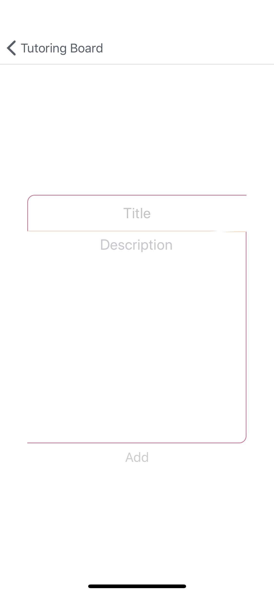
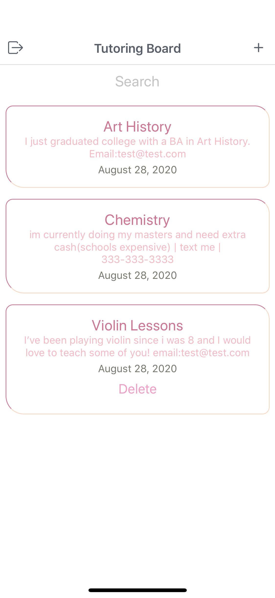
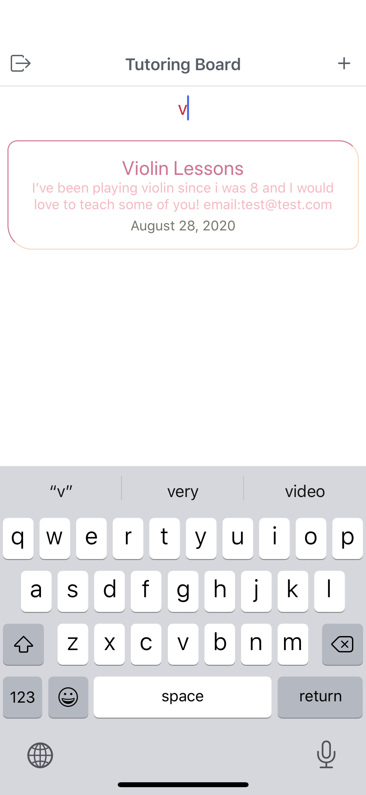

# [Tutoring Board](https://expo.io/@spacecowboy/tutoring-board)

## Tools used in this app

> MongoDB, Express,React Native, Node.js, Redux,

## I built the backend first to make a web app, so then I decided to make a native app to go along with the web app.

## Login/Sign Up Screen

## Add New Tutoring Post Screen

## All Tutoring Post Screen

## Tutoring Post Search Screen

